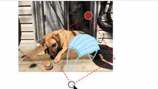

# drag-img
移动端旋转、缩放、移动图片组件（仅支持移动端）

# 安装   
```
npm install drag-img -S
```  

# 使用  
1. 直接引用  
``` css
/* 旋转按钮图片 */
.dragRotateScale_move .dragRotateScale_rotate {
    background-image: url('../../static/b.jpg');
}
/* 关闭按钮图片 */
.dragRotateScale_move .dragRotateScale_close {
    background-image: url('../../static/b.jpg');
}
```    
``` javascript
<script type="text/javascript" src="./dragRotateScale.js"></script>
let preImg2 = document.getElementById('preImg2')
new dragRotateScale(preImg2, {
    ...
})
```

2. npm   
``` css
/* 旋转按钮图片 */
.dragRotateScale_move .dragRotateScale_rotate {
    background-image: url('../../static/b.jpg');
}
/* 关闭按钮图片 */
.dragRotateScale_move .dragRotateScale_close {
    background-image: url('../../static/b.jpg');
}
```    
``` javascript
import dragrotatescale from 'drag-img'
new dragrotatescale(preImg2, {
    src: img,         //要拖动的图片地址
    rotateButton: 30, // 按钮的宽高
    imgScaleMax: 10,  //缩放限制
    imgScaleMin: 0.1,
    rotateStart() {   //钩子
        console.log('rotateStart')
    },
    rotateMove(o) {
        console.log('rotateMove', o)
    },
    imgStart() {
        console.log('imgStart')
    },
    imgMove() {
        console.log('imgMove')
    },
    imgEnd() {
        console.log('imgEnd')
    },
    imgClose() {
        console.log('imgClose')
    }
})


```   
# 预览  

